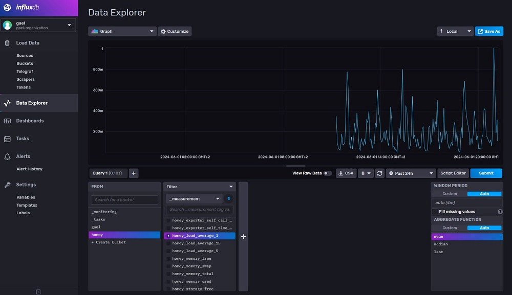
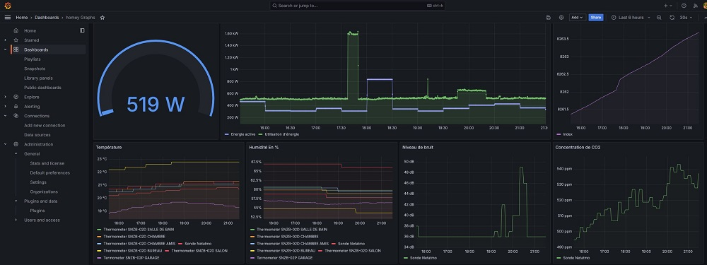

# Un peu plus loin et conclusion

## 1. Ajouter le scraper Homey dans l'UI Influxdb2

- Créer un bucket (Load data -> Buckets -> Create bucket)
- Créer un scraper (Load data -> Scrappers -> Create scraper) en lui affectant le bucket précédement créé et en indiquant l'url des métriques Homey :  
`(http://ip-box-homey:9414/metrics)`
- Faites votre première requête :

## 2. Ajouter la data source dans Grafana

- Toujours dans l'UI Influxdb2, récupérer ou créer un token (Load data -> Tokens)
- Dans l'UI Grafana, dérouler "Connections" puis cliquer sur "Data sources"
- Cliquer sur "Add new data source"
- Chercher "influxdb", cliquer sur l'icone puis remplir le formulaire. Vous pourrez utiliser votre token dans les paramètres de connexion à la base Influxdb.

